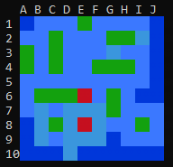
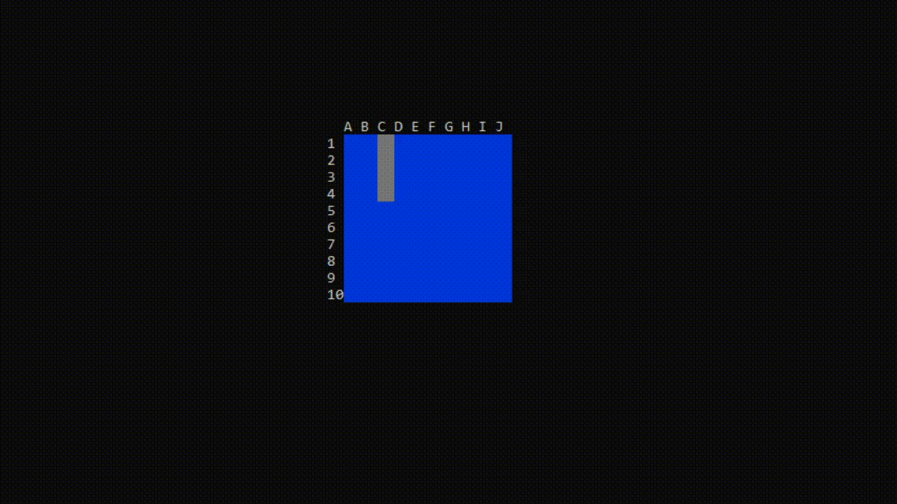
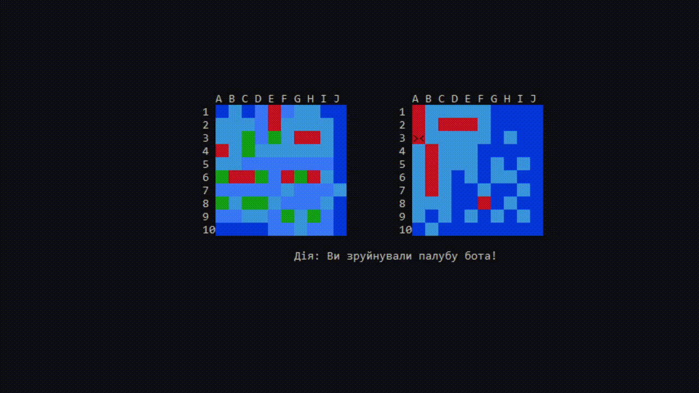
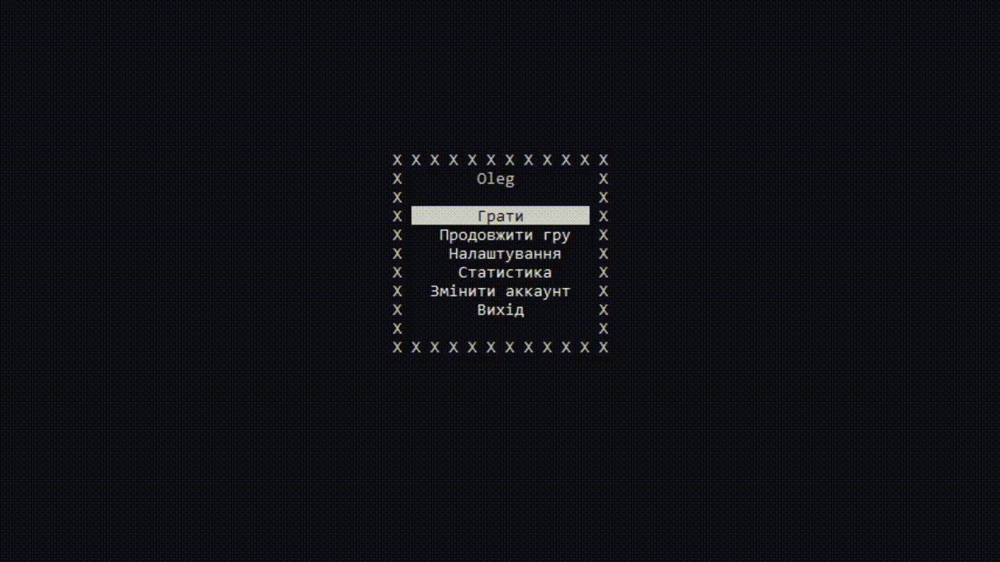
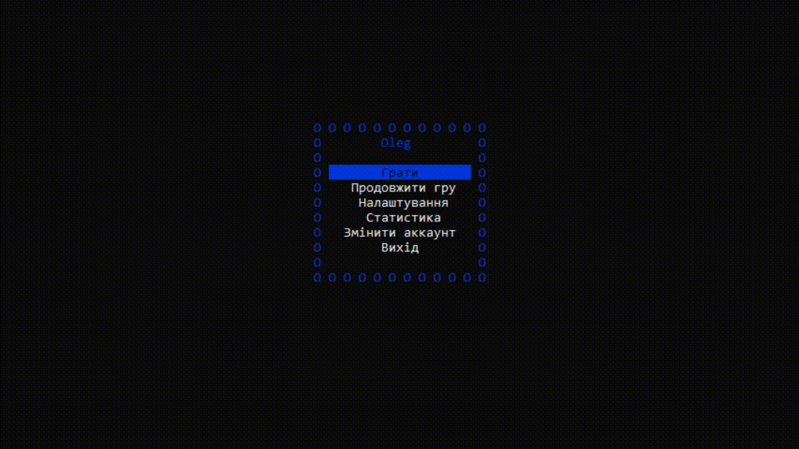

# Курсовий проект "Морський бій". 
#### Виконав Гомбош Олег. Навчальний заклад КА "ШАГ". Група: ПВ123
# Розділи
* ### [Вступ](#Вступ)
* ### [Опис основних завдань](#Опис-основних-завдань)

---------------
# Вступ
Мета і завдання: 
* Визначити та описати завдання які мають бути вирішені.
* Створити гру [Морський бій](https://uk.wikipedia.org/wiki/%D0%9C%D0%BE%D1%80%D1%81%D1%8C%D0%BA%D0%B8%D0%B9_%D0%B1%D1%96%D0%B9_(%D0%BD%D0%B0%D1%81%D1%82%D1%96%D0%BB%D1%8C%D0%BD%D0%B0_%D0%B3%D1%80%D0%B0)). 
* Описати процес розробки. 
* Протестувати гру та виправити виявлені помилки. 
* Зробити висновки.

При розробці гри, потрібно використати **C++** та **тільки** вбудовані бібліотеки. Також, вказати **джерела** які були 
використані в процесі розробки.

---------------
# Опис основних завдань


* [Поле та можливість його зміни](#Реалізація-ігрового-поля)
* [Ручна розстановка](#Вручну)
* [Автоматична розстановка](#Автоматично)
* [Штучний інтеллект](#Штучний-інтеллект)
* [Графічний інтерфейс](#Реалізація-графічного-інтерфейсу)
* [Система акаунтів](#Система-акаунтів)
* [Налаштування до кожного з аккаунтів](#Налаштування)
* Демонстраційний режим
* [Можливість зберегти та продовжити гру](#Збереження-та-вивантаження-гри)
* [Додати статистику](#Статистика)

Також, після створення гри, код має бути гнучким та легким для редагування або додавання нових фіч.


---------------
# Розробка

#### Реалізація ігрового поля
Створити ігрове поле я вирішив з допомогою структури "Field"
```asm
struct Field {
Cell cells[10][10];                     
int ships[10]{ 4,3,3,2,2,2,1,1,1,1 };
int shipCount{ 0 };
};
```
> Код взято з [header.h](FinalProject/Header.h)

Cell cells[10][10] - Це масив клітинок 10х10. Клітинку я вирішив створити з допомогою структури Cell. 
Це зумовлено тим, що елементи поля я записую як цілі числа. Але при ручному розміщенні, користувач при переміщенні, 
перезаписує їх під інше число (в данному випадку, число корабля, який він розміщує). Тому було створено структуру "Cell", 
в якій знаходяться 2 змінні, перша відповідає за змінні клітинки, друга за незмінні (підтвердежні) 

```asm
struct Cell {
    int type = 0;         // Змінна клітинка
    int verifyType = 0;   // Незмінна клітинка
};
```
> Код взято з [header.h](FinalProject/Header.h)

int ships[10]{ 4,3,3,2,2,2,1,1,1,1 } - Розмір масиву це кількість кораблів. Число, це кількість палуб корабля.

int shipCount{ 0 }; - Це змінна, яка дозволяє розставити кораблі так, щоб у кожного був свій номер у масиві. 
Це в свою чергу, дозволяє визначити індекс корабля в масиві "ships" вже після розстановки і виявити, чи він потоплений.

Для того щоб не заплутатись яка цифра за який елемент відповідає, я створив enum "Cells":
```asm
enum Cells {
    EMPTY = 0, SHIP_PLACE = 1, AIM = 2, 
    DESTROY_SHIP = 1, MISS = 2, AROUND = 3,
    AROUND_DESTROY = 4, SHIP = 5,
};
```
> Код взято з [header.h](FinalProject/Header.h)


І ось після того, як ми створили структуру поля, визначили за що відповідає кожна клітинка, настав час створити функцію,
яка буде виводити поле так, як потрібно нам.
```asm
void fieldPrint(Field& Field, const int xMove, const int yMove, int y, bool isBot, int x, ConsoleColor color) {
    string numeric = "ABCDEFGHIJ";
    int i, j;
    cout << endl;
    for (i = 0; i < MAP_SIZE; i++) {
        cout << "  ";
        for (j = 0; j < MAP_SIZE; j++) {
            if (Field.cells[i][j].type == AIM) {
                SetColor(BLACK, RED_FADE);
                SetCursorPosition((x + j) * 2, y + i);
                cout << "><";
                continue;
            }
            else if (Field.cells[i][j].verifyType == DESTROY_SHIP) {
                SetColor(RED_FADE, RED_FADE);
            }
            else if (Field.cells[i][j].verifyType == MISS) {  // Мимо
                SetColor(TEAL_FADE, TEAL_FADE);
            }
            else if (Field.cells[i][j].type == SHIP_PLACE) {
                SetColor(GRAY, GRAY);
            }
            else if (Field.cells[i][j].verifyType == AROUND_DESTROY) {
                SetColor(TEAL_FADE, TEAL_FADE);
            }
            else if (Field.cells[i][j].verifyType == AROUND && !isBot) {
                SetColor(BLUE, BLUE);
            }
            else if (Field.cells[i][j].verifyType >= SHIP && !isBot) {
                SetColor(GREEN_FADE, GREEN_FADE);
            }
            else if (Field.cells[i][j].type == EMPTY) {
                SetColor(BLUE_FADE, BLUE_FADE);
            }
            SetCursorPosition((x + j) * 2, y + i);
            cout << "**";
        }
        SetColor(BLACK, BLACK);
        cout << "00" << endl;
        SetColor(GRAY, BLACK);
    }
    
    SetColor(color, BLACK);

    for (i = 0; i < MAP_SIZE; i++) {
        SetCursorPosition(x * 2 - 2, y + i);
        cout << i + 1;
        SetCursorPosition((x + i) * 2, y - 1);
        cout << numeric[i];
    }
}
```
> Код взято з [Field.cpp](FinalProject/Field.cpp)

Функція приймає такі аргументи: Поле, координати х і у це знаходиться користувач при розстановці, чи це бот, де розміщати поле
в консолі та колір розмітки. Працює вона ніби "накладанням". Спочатку перевіряються ті клітинки, яки мають більший приорітет,
потім ті що менший. Умовно це можна уявити собі так "Прицел > Зламана палуба > Промах > Корабель при розставленні > 
Обводка зруйнованого корабля > Обводка звичайного корабля > Корабель > Пустота". Кожна клітинка має свій колір, що дозволяє
легше сприймати гру для звичайного користувача. В результаті ми отримуємо таке поле:



Для зручності, я додатково створив enum "Positions", який визначає типові координати для розміщення певних елементів:
```asm
enum Positions {
    Y_ALL = 8,
    Y_WIN = 12,
    Y_MESSAGES = 19,
    X_PLAYER_FIGHT = 20,
    X_MENU = 24,
    X_PLAYER_PLACE = 24,
    X_MESSAGES = 26,
    X_BOT_FIGHT = 35,
    X_WIN = 25,
};
```
> Код взято з [header.h](FinalProject/Header.h)

Думаю по назвам зрозуміло що за що відповідає.

---------------
### Розміщення

Користувачеві доступні два варіанта розміщення: Автоматично та вручну.


---------------
###### Автоматично
Автоматичне розміщення відбувається з допомогою цієї функції:

```asm
void autoFieldPlacing(Field& Field) {
    for (int i = 0; i < 10; i++) {
        autoShipPlacing(Field, Field.ships[i]);
    }
}
```
> Код взято з [Field.cpp](FinalProject/Field.cpp)

В неї ми передаємо посилання на поле та 10 раз викликаємо наступну функцію:
```asm
void autoShipPlacing(Field& Field, const int shipSize) {
    int i, x{-1}, y{-1};
    bool vertical{ true }, insertedPossible;
    start: while (true) {
        insertedPossible = true;
        x = rand() % MAP_SIZE;
        y = rand() % MAP_SIZE;
        if (x + shipSize >= MAP_SIZE) goto start;
        if (y + shipSize >= MAP_SIZE) goto start;
        vertical = rand() % 2;
        for (i = 0; i < shipSize; i++) {
            if (vertical) {
                if (!shipAround(Field, y + i, x)) goto start;
            }
            else {
                if (!shipAround(Field, y, x + i)) goto start;
            }
        }
        enterVerifyType(Field, y, x, shipSize, vertical);
        fieldAroundInsert(Field, y, x, AROUND);
        // Інкремент щоб у кожного корабля був свій індекс
        Field.shipCount++;
        break;
    }
}
```
> Код взято з [Field.cpp](FinalProject/Field.cpp)

Вона в свою чергу теж приймає посилання на поле і також розмір корабля, який потрібно розмістити.
Потім запускається цикл, який виконується до того моменту, поки корабель не буде поставлено.
В тілі циклу обираються рандомні координати та напрямок корабля. Якщо він не влізає, тоді цикл починається спочатку
з допомогою "goto start". Чому не було використано звичайний "continue"? Тому-що в циклі "while" ще існує вкладенний цикл
"for" і коли ми пишемо "continue", він починає спочатку вкладений цикл, що ніяк не вирішує проблеми.


---------------

###### Вручну
Ручне розміщення відбувається з допомогою цієї функції:

```asm
void userFieldPlacing(Field& Field, Settings settings) {
    for (int i = 0; i < 10; i++) {
        shipPlace(Field, Field.ships[i], settings);
    }
}
```
> Код взято з [Field.cpp](FinalProject/Field.cpp)

В неї ми передаємо посилання на поле і налаштування. Налаштування потрібні щоб розмітка мала такий колір, який задав користувач. 
Потім 10 раз викликаємо наступну функцію:
```asm
void shipPlace(Field& Field, int shipSize, Settings settings) {
    int i, x{ 0 }, y{ 0 }, key;
    bool vertical{ true }, insertedPossible{ true };
    start: while (true) {
        fieldPrint(Field, x, y, Y_ALL, false, X_PLAYER_PLACE, settings.color);
        key = _getch();
        if (key == ENTER) {
            for (i = 0; i < shipSize; i++) {
                if (vertical) {
                    if (!shipAround(Field, y + i, x)) goto start;
                }
                else {
                    if (!shipAround(Field, y, x + i)) goto start;
                }
            }
            enterVerifyType(Field, y, x, shipSize, vertical);
            fieldAroundInsert(Field, y, x, AROUND);
            break;
        }
        changeTypePosition(Field, shipSize, vertical, x, y, EMPTY);
        moveShip(vertical, x, y, shipSize, key);
        changeTypePosition(Field, shipSize, vertical, x, y, SHIP_PLACE);
    }
}
```
> Код взято з [Field.cpp](FinalProject/Field.cpp)

Думаю пояснювати що й чому приймає ця функція не має сенсу, але поясню те, як вона працює.
Спочатку ми малюємо поле з допомогою функції "fieldPrint()", потім користувач натискає будь-яку клавішу. При натисканні cтрілок, 
ми прибираємо корабель, визначаємо нові координати та вже на нових координатах, записуємо корабель як звичайний "cell.type". 
Якщо користувач натискає "Enter", тим самим даючи поняти що він визначився з місцем розташування корабля, то ми перевіряємо чи не є поряд з цим
кораблем ще одного корабля, записуємо цей корабель вже у "cell.verifyType" і припиняємо виконання циклу.

Ось який це має вигляд:




---------------

### Руйнування кораблів

Руйнування кораблів поділяється на два типа. Руйнування користувачем та ботом. 

Сама функція гри виглядає так:
```asm
void play(Field& playerField, Field& enemyField, Settings settings, User& user) {
    int i, j;
    AI Ai;
    string name;
    system("cls");
    int action;
    bool step{ true }, winner;
    while (!isShips(playerField.ships) && !isShips(enemyField.ships)) {
        fieldPrint(playerField, -1, -1, Y_ALL, false, X_PLAYER_FIGHT, settings.color);
        fieldPrint(enemyField, -1, -1, Y_ALL, true, X_BOT_FIGHT, settings.color);
        if (step) {
            step = !step;
            if (playerAttack(enemyField, action, settings, playerField, user)) {
                step = !step;
                user.shipsDestroyer++;
            }
        }
        else {
            difficultyChoiceAttack(settings, playerField, Ai, action, step);
        }
        actionDescription(X_MESSAGES * 2, Y_MESSAGES, action, settings.color);
    }
    if (isShips(playerField.ships)) name = "Переміг бот";
    else {
        name = "Ви перемогли";
        user.wins++;
    }
    user.games++;
    winAction(playerField, enemyField, settings, name);
}
```
> Код взято з [Attack.cpp](FinalProject/Attack.cpp)

Приймається два поля (користувача й бота), налаштування і акаунт користувача.
Потім взалежності від "step", обирається хто ходить. Якщо true - користувач.
Якщо false - бот.
step - змінюється кожен хід, але якщо кимось було влучено в корабель, то step
не змінюється і продовжує ходити той, хто влучив.


---------------
###### Руйнування користувачем

У функції руйнування корабля користувачем, ми передаємо поле бота, дію яка буде відображена після вистрілу, налаштування 
для кольору розмітки, поле користувача і акаунт користувача щоб в разі чого, при натисканні ESC гра зберігалась й припинялась.
```asm
bool playerAttack(Field& botField, int& action, Settings settings, Field& playerField, User user) {
    int dir{0}, key, x{0}, y{0}, shipSize{0};
    while (true) {
        fieldPrint(botField, -1, -1, Y_ALL, true, X_BOT_FIGHT, settings.color);
        key = _getch();
        botField.cells[y][x].type = EMPTY;
        switch (key) {
        case ENTER:
            if (botField.cells[y][x].verifyType == MISS || botField.cells[y][x].verifyType == DESTROY_SHIP) continue;

            if (botField.cells[y][x].verifyType >= SHIP) {
                botField.ships[botField.cells[y][x].verifyType - SHIP]--;
                if (botField.ships[botField.cells[y][x].verifyType - SHIP] == 0) {
                    fieldAroundInsert(botField, y, x, AROUND_DESTROY);
                    action = BOT_SHIP_DESTROY;
                }
                else action = BOT_DECK_DESTROY;
                botField.cells[y][x].verifyType = DESTROY_SHIP;
                return true;
            }
            else {
                botField.cells[y][x].verifyType = MISS;
                action = PLAYER_MISS;
                return false;
            }
            break;
        case UP_ARROW: 
            if(y - 1 != -1) y--;
            break;
        case DOWN_ARROW:
            if (y + 1 != MAP_SIZE) y++;
            break;
        case LEFT_ARROW: 
            if (x - 1 != -1) x--;
            break;
        case RIGHT_ARROW:
            if (x + 1 != MAP_SIZE) x++;
            break;
        case ESC:
            saveUserGame(user, playerField, botField);
            exit(0);
            break;
        default: break;
        }
        botField.cells[y][x].type = AIM;
    }
}
```
> Код взято з [Attack.cpp](FinalProject/Attack.cpp)

Ця функція повертає те, чи влучив користувач. У функції цикл працює до того моменту, поки не буде повернено якесь значення.
Код дуже схожий до розставлення корабля, але відрізняється тим, що тут замість корабля, ми переміщуємо приціл і при натисканні
відбувається вистріл, який вже визначає, чи потрапила людина. Якщо так, то від корабля віднімається одна палуба, сама палуба стає зруйнованою,
перевірається чи взагалі є ще живі палуби у корабля, якщо ні, тоді він обводиться і на екран виведеться повідомлення про те, 
що корабель зруйновано, або те, що зруйновано одну палубу, якщо ще є живі палуби. В разі якщо людина промахнулась, тоді клітинка
позначається як "промах" і по ній більше неможливо вистрілити, також виводиться повідомлення про промах.

Ось який це має вигляд:</br>


---------------
###### Руйнування ботом

Існують дві атаки у бота. Перша - рандомно, друга - з використанням алгоритму, який при попаданні добиває корабель. 
Вибір атаки виконує ця функція:

```asm
void difficultyChoiceAttack(Settings settings, Field& Field, AI& Ai, int& action, bool& step) {
    int x, y;
    if (settings.difficulty) {
        step = !step;
        if (AIAttack(Field, Ai, action)) {
            if (Ai.decksCount == 0) fieldAroundInsert(Field, Ai.hintY, Ai.hintX, AROUND_DESTROY);
            step = !step;
        }
    }
    else {
        step = !step;
        if (botAttack(Field, action,x, y)) {
            if (isShips(Field.ships)) fieldAroundInsert(Field, x, y, AROUND_DESTROY);
            step = !step;
        }
    }
}
```
> Код взято з [Attack.cpp](FinalProject/Attack.cpp)

Якщо "settings.difficulty" дорівнює "false" - тоді бот завжди б'є рандомно. Якщо
"true" - тоді бот після попадання по кораблю, добиває його.

Функція "botAttack" приймає поле, дію яка буде відображатись після ходу та x, y на випадок, якщо він зруйнує корабель.
```asm
bool botAttack(Field& Field, int& action, int& xReturn, int& yReturn) {
    int x, y;
    while (true) {
        x = rand() % MAP_SIZE;
        y = rand() % MAP_SIZE;
        if (Field.cells[y][x].verifyType == MISS || Field.cells[y][x].verifyType == DESTROY_SHIP) continue;

        if (botHint(Field, y, x)) {
            Field.ships[Field.cells[y][x].verifyType - SHIP]--;
            if (Field.ships[Field.cells[y][x].verifyType - SHIP] == 0) {
                fieldAroundInsert(Field, y, x, AROUND_DESTROY);
                Field.cells[y][x].verifyType = DESTROY_SHIP;
                xReturn = x;
                yReturn = y;
                return true;
            }
            Field.cells[y][x].verifyType = DESTROY_SHIP;
            return true;
        }
        else {
            action = BOT_MISS;
            return false;
        }
    }
}
```
> Код взято з [Attack.cpp](FinalProject/Attack.cpp)

Стріляє бот абсолютно рандомно, але якщо потрапляє в уже зруйнований корабель, або туди, куди він вже стріляв, тоді координати
обираються спочатку.

Щодо штучного інтеллекту, про нього поговоримо згодом.

---------------
### Реалізація графічного інтерфейсу

В проекті реалізовано більше 5 різних меню (Меню логіну, меню налаштувань, головне меню, тощо.) Тому я вирішив написати для
них одну функцію.
```asm
int startMenu(const int x, const int y, int menuSize, int arrSize, string* MenuParagraph, string Name, Settings settings) {
    system("cls");
    int key, activeOption{ 0 };
    MenuPrint(menuSize, x, y, settings.graphUnit, Name, settings.color);        // Виведення меню без кнопок
    MenuOptionsPrint(menuSize, x, y, activeOption, MenuParagraph, arrSize, settings.color);     // Виведення кнопок
    while (true) {
        key = _getch();
        if (key != -1) {
            switch (key) {
            case ENTER:
                system("cls");
                return activeOption;
                break;
            case UP_ARROW:
                if (activeOption > 0) activeOption--;
                else activeOption = arrSize - 1;
                MenuOptionsPrint(menuSize, x, y, activeOption, MenuParagraph, arrSize, settings.color);
                break;
            case DOWN_ARROW:
                if (activeOption < arrSize - 1) activeOption++;
                else activeOption = 0;
                MenuOptionsPrint(menuSize, x, y, activeOption, MenuParagraph, arrSize, settings.color);
                break;
            default: break;
            }
        }
    }
}
```
> Код взято з [Menu.cpp](FinalProject/Menu.cpp)

Вона приймає x та y розміщення, розмір меню, розмір массиву з кількістю пунктів, назву меню та налаштування. Працює поки
не буде повернено якесь зі значень. В цілому код досить простий і зрозумілий. Якщо людина намагається вибратись за межі
масиву, тоді вона або повертається на початок, або переходить у кінець.

Ось як це виглядає:</br>

Також UI може бути модифікований користувачем. Можна змінити колір та символ. Це відбувається у цих двох функціях
```asm
char changeChar(Settings settings) {
    begin:
    char graphUnit;
    MenuPrint(3, X_MENU * 2.3, Y_ALL, settings.graphUnit, "", settings.color);
    SetCursorPosition(X_MENU * 2, Y_ALL + 4);
    cout << "Введіть будь-який символ";
    SetCursorPosition(X_MENU * 2.4 + 1, Y_ALL + 1);
    cin >> graphUnit;
    return graphUnit;
}
```
> Код взято з [Menu.cpp](FinalProject/Menu.cpp)

```asm
int changeColor(Settings settings) {
    begin:
    int choice;
    MenuPrint(3, X_MENU * 2.3, Y_ALL, settings.graphUnit, "", settings.color);
    SetCursorPosition(X_MENU * 1.8, Y_ALL + 4);
    for (i = 1; i < 16; i++) {
    SetColor((ConsoleColor)i, BLACK);
    cout << i << " ";
    SetCursorPosition(X_MENU * 2.4 + 1, Y_ALL + 1);
    cin >> choice;
    if (choice < 1 || choice > 16) goto begin;
    return choice;
}
```
> Код взято з [Menu.cpp](FinalProject/Menu.cpp)

Людина обирає бажанний параметр і змінює його так, як вона того захоче. Функції написано досить зрозуміло, тому нема сенсу
їх додатково пояснювати, краще покажу як вони працюють:<br/>

Окрім цього, якщо користувач цього забажає, він може скинути налаштування до звичайних:<br/>

Це виконує ця функція:
```asm
void settingsToDefault(User& user) {
    user.color = RED_FADE;
    user.graphUnit = '*';
    user.difficulty = false;
}
```
> Код взято з [Accounts.cpp](FinalProject/Accounts.cpp)


---------------
### Система акаунтів

Дуже важливою частиною є система акаунтів. Вона має зберігати данні користувача, статистику, налаштування та ігри користувача.


---------------
###### Структура
Для того щоб легше оперувати данними користувача, я вирішив створити структуру "User":
```asm
struct User {
    string login;
    string password;
    char graphUnit;
    bool difficulty;
    int color;
    int wins;
    int games;
    int shipsDestroyer;
    int percentOfWin;
};
```
> Код взято з [header.h](FinalProject/Header.h)


Вона включає в себе:
1. Логін користувача.
2. Пароль користувача.
3. Символ меню.
4. Складність бота.
5. Колір меню.
6. Кількість виграшів.
7. Кількість ігор.
8. Кількість зруйнованих кораблів.
9. Відсоток перемог.

Використання структури в данному випадку є досить зручним.


----------------

###### Реєстрація

Реєстрація відбувається з допомогою функції "registerNewUser()":
```asm
User registerNewUser() {
    User user;

    user.color = RED_FADE;
    user.graphUnit = '*';
    user.difficulty = false;
    user.wins = 0;
    user.games = 0;
    user.shipsDestroyer = 0;
    user.percentOfWin = 0;
    string confirmPassword;
    while (true) {
        SetColor(BLACK, BLACK);
        system("cls");
        MenuPrint(15, X_MENU * 2, Y_ALL, '*', "Реєстрація", RED_FADE);
        SetCursorPosition(X_MENU * 2 + 3, Y_ALL + 5);
        cout << "Логін: ";
        getline(cin, user.login);
        SetCursorPosition(X_MENU * 2 + 3, Y_ALL + 6);
        cout << "Пароль: ";
        SetColor(BLACK, BLACK);
        getline(cin, user.password);
        SetColor(RED_FADE, BLACK);
        SetCursorPosition(X_MENU * 2 + 3, Y_ALL + 7);
        cout << "Підтвердження: ";
        SetColor(BLACK, BLACK);
        getline(cin, confirmPassword);

        SetColor(RED, BLACK);
        bool valid = true;
        if (user.login.size() < 4) {
            SetCursorPosition(X_MENU * 2 + 3, Y_ALL + 8);
            cout << "Логін менше 4 символів" << endl;
            valid = false;
        }
        if (user.password.size() < 5) {
            SetCursorPosition(X_MENU * 2 + 3, Y_ALL + 9);
            cout << "Пароль менше 5 символів" << endl;
            valid = false;
        }
        if (user.password != confirmPassword) {
            SetCursorPosition(X_MENU * 2 + 3, Y_ALL + 10);
            cout << "Паролі не однакові" << endl;
            valid = false;
        }
        if (userExists(user)) {
            SetCursorPosition(X_MENU * 2 + 3, Y_ALL + 11);
            cout << "Користувач існує" << endl;
            valid = false;
        }
        SetColor(WHITE, BLACK);
        if (valid) {
            break;
        }
        else {
            system("pause");
        }
        system("cls");

    }
    saveUser(user);
    return user;
}
```
> Код взято з [Accounts.cpp](FinalProject/Accounts.cpp)

Спочатку вона cтворює користувача та задає йому стандартні параметри. Далі виводить поле для вводу данних і після цього
перевіряє їх на правильність. Якщо логін і пароль відповідають таким вимогам як - унікальність і більше 4 символів
тоді аккаунт зберігається у файлі і повертає ці налаштування

----------------

###### Логін

Логін теж відбувається в досить великій функції під назвою "loginUser()":

```asm
User loginUser() {

    User user;
    string password;
    while (true) {
        SetColor(BLACK, BLACK);
        system("cls");
        MenuPrint(15, X_MENU * 2, Y_ALL, '*', "Логін", RED_FADE);
        SetCursorPosition(X_MENU * 2 + 3, Y_ALL + 5);
        cout << "Логін: ";
        getline(cin, user.login);
        SetCursorPosition(X_MENU * 2 + 3, Y_ALL + 6);
        cout << "Пароль: ";
        SetColor(BLACK, BLACK);
        getline(cin, password);

        SetColor(RED, BLACK);
        bool valid = true;
        if (valid && !userExists(user)) {
            SetCursorPosition(X_MENU * 2 + 3, Y_ALL + 7);
            cout << "Логіна не існує" << endl;
            valid = false;
        }
        else {
            loadUser(user);
        }

        if (valid && user.password != password) {
            SetCursorPosition(X_MENU * 2 + 3, Y_ALL + 8);
            cout << "Невірний пароль" << endl;
            valid = false;
        }

        SetColor(WHITE, BLACK);
        if (valid) {
            break;
        }
        else {
            system("pause");
        }
        system("cls");

    }
    return user;
}
```
> Код взято з [Accounts.cpp](FinalProject/Accounts.cpp)

По суті просто перевіряє правильність введених данних і повертає користувача, якщо данні є валідними.

-----------

### Налаштування
Метою проекта, також, було створення налаштувань, щоб кожен користувач міг підлаштувати під себе графічний інтерфейс гри.

----------

###### Структура

Для збереження налаштувань, була створена структура "settings":
```asm
struct Settings {
    char graphUnit;
    bool difficulty;
    ConsoleColor color;
};
```
> Код взято з [header.h](FinalProject/Header.h)


Досить простенька, включає в себе:
1. Символ меню
2. Складність бота
3. Колір меню

Записується вона відразу після логіну користувача і кожен раз після зміни

-------------------

###### Зміна налаштувань

Зміна налаштувань відбувається у цих двох функціях:


В цій відбувається зміна символа меню:
```asm
char changeChar(Settings settings) {
begin:
    char graphUnit;
    MenuPrint(3, X_MENU * 2.3, Y_ALL, settings.graphUnit, "", settings.color);
    SetCursorPosition(X_MENU * 2, Y_ALL + 4);
    cout << "Введіть будь-який символ";
    SetCursorPosition(X_MENU * 2.4 + 1, Y_ALL + 1);
    cin >> graphUnit;
    return graphUnit;
}
```
> Код взято з [Field.cpp](FinalProject/Field.cpp)

В цій відбувається зміна кольору меню:
```asm
int changeColor(Settings settings) {
    begin:
    int choice;
    MenuPrint(3, X_MENU * 2.3, Y_ALL, settings.graphUnit, "", settings.color);
    SetCursorPosition(X_MENU * 1.8, Y_ALL + 4);
    for (i = 1; i < 16; i++) {
        SetColor((ConsoleColor)i, BLACK);
        cout << i << " ";
    }
    SetCursorPosition(X_MENU * 2.4 + 1, Y_ALL + 1);
    cin >> choice;
    if (choice < 1 || choice > 16) goto begin;
    return choice;
}
```
> Код взято з [Field.cpp](FinalProject/Field.cpp)

---------------
### Статистика
Кожному користувачу буде інтересно подивитись його статистику і можливо навіть порівняти її з іншими. Це додає змагальний
елемент

--------------

###### Структура

У статистики нема структури, бо вона записана вже у файлі користувача, тому, все що потрібно, це просто красиво її звідти
дістати

------------


###### Відображення 

Для вібораження структури створено функцію "StatisticMenu":
```asm
void StatisticMenu(const int x, const int y, int menuSize, User user, Settings settings) {
    MenuPrint(menuSize, x, y, settings.graphUnit, "Статистика", settings.color);
    SetCursorPosition(X_MENU * 2.1 + 1, Y_ALL + 3);
    cout << "Ігри: " << user.games;
    SetCursorPosition(X_MENU * 2.1 + 1, Y_ALL + 4);
    cout << "Перемоги: " << user.wins;
    SetCursorPosition(X_MENU * 2.1 + 1, Y_ALL + 5);
    cout << "Відсоток перемог: " << (int)user.percentOfWin << "%";
    SetCursorPosition(X_MENU * 2.1 + 1, Y_ALL + 6);
    cout << "Зруйновані кораблі: " << user.shipsDestroyer;

    SetCursorPosition(X_MENU * 2.1 + 1, Y_ALL + menuSize - 3);
    cout << "Натисніть любу клавішу!";
    _getch();
}
```
> Код взято з [Menu.cpp](FinalProject/Menu.cpp)

Вона приймає звичайні аргументи меню. Де розмістити (х,у), розмір меню, користувача з файлу якого будуть діставати статистику
і налаштування, щоб вивести з такими параметрами, з якими це бажає зробити користувач.

-----------

### Збереження та вивантаження гри
Інколи буває таке, що ти не встигаєш дограти гру, або по якимось інакшим причинам, тобі потрібно зберігтись, щоб потім 
знову продовжити грати. Для цього потрібно створити можливість зберігати гру

-----------

###### Збереження

Як зазначалось вище, щоб зберегти гру, потрібно нажати "Escape". Після цього, запускається
функція "SaveUserGame":
```asm
void saveUserGame(const User& user, Field Field1, Field Field2) {
    int i, j;
    ofstream file(user.login + "Game" + ".txt");
    for (i = 0; i < MAP_SIZE; i++) {
        for (j = 0; j < MAP_SIZE; j++) {
            file << Field1.cells[i][j].verifyType << " ";
        }
        file << endl;
    }
    file << endl;
    for (i = 0; i < MAP_SIZE; i++) {
        for (j = 0; j < MAP_SIZE; j++) {
            file << Field2.cells[i][j].verifyType << " ";
        }
        file << endl;
    }
    file << endl;
    for (i = 0; i < MAP_SIZE; i++) {
        file << Field1.ships[i] << " ";
    }
    file << endl;
    for (i = 0; i < MAP_SIZE; i++) {
        file << Field2.ships[i] << " ";
    }
    file.close();
}
```
>Взято з [Accounts.cpp](FinalProject/Accounts.cpp)

Ця функція записує поле ігрока та поле бота, а також те, скільки залишилось у них палуб. Зберігає це все у файл
"@username@Game.txt"

------------

###### Вивантаження

Щоб вивантажити та продовжити гру, потрібно в головному мені натиснути "Продовжити гру".
Після цього запускається функція "resumeGame":
```asm
void resumeGame(Settings settings, User user) {
    if (!gameExists(user)) return;
    Field Field1, Field2; 
    loadUserGame(user, Field1, Field2);
    play(Field1, Field2, settings, user);
}
```
>Взято з [Controller.cpp](FinalProject/Controller.cpp)

Вона перевіряє чи існує взагалі файл збереження і якщо так, то запускає функцію "loadUserGame":
```asm
void loadUserGame(const User& user, Field& Field1, Field& Field2) {
    string trash;
    int i, j;
    ifstream file(user.login + "Game" + ".txt");
    for (i = 0; i < MAP_SIZE; i++) {
        for (j = 0; j < MAP_SIZE; j++) {
            file >> Field1.cells[i][j].verifyType;
        }
        getline(file, trash);
    }
    getline(file, trash);
    for (i = 0; i < MAP_SIZE; i++) {
        for (j = 0; j < MAP_SIZE; j++) {
            file >> Field2.cells[i][j].verifyType;
        }
        getline(file, trash);
    }
    getline(file, trash);
    for (i = 0; i < MAP_SIZE; i++) {
        file >> Field1.ships[i];
    }
    getline(file, trash);
    for (i = 0; i < MAP_SIZE; i++) {
        file >> Field2.ships[i];
    }
    file.close();
}
```
>Взято з [Accounts.cpp](FinalProject/Accounts.cpp)

Вона записує у ці два поля данні бота та користувача. Єдине що потрібно підмітити, тут використовуєтья
"string trash" для того, щоб з допомогою "getline" переходити на наступну строку у файлі.

-----------

### Штучний інтеллект
Грати зі звичайним ботом, який просто стріляє наугад неінтересно і досить легко. Для цього було створено штучний
інтеллект, який має деяку логіку.

----------

###### Структура

Штучний інтеллект має містити багато інформації, яку можна обробити та зрозуміти, куди бити далі.
Для цього було створено структуру "AI":

```asm
struct AI {
    int hintX{ -1 };  // Перше попадання по X
    int hintY{ -1 };  // Перше попадання по Y
    int decksCount{ 0 };
    int dir{ 0 };     // Напрямок наступного пострілу
    int x{ -1 };      // Наступний постріл по x
    int y{ -1 };      // Наступний постріл по y
};
```
> Код взято з [Header.h](FinalProject/Header.h)

Вона містить перше попадання по x та по y (hintX, hintY відповідно), зі скількох палуб складається корабель в який
він попав, напрям наступного пострілу та координати наступного пострілу.

----------

###### Алгоритм

Алгоритм в цілому досить простий. Спочатку бот стріляє наугад, якщо попадає, тоді він починає добивати корабель.
Спочатку двигається вниз, потім вверх, потім вліво і кінець кінцем управо. Для того щоб легше розуміти куди буде направлений
наступний постріл корабля, я створий enum "Directions":

```asm
enum Directions {
    DOWN = 0, 
    LEFT = 1, 
    UP = 2, 
    RIGHT = 3,
};
```
> Код взято з [Header.h](FinalProject/Header.h)

----------

###### Реалізація алгоритму
Основною функцією є "AIAttack". Вона обирає як буде стріляти бот, наугад чи з використанням алгоритму добивання.

```asm
bool AIAttack(Field& Field, AI& Ai, int& action) {
	if (Ai.decksCount < 1) {
		while (true) {
			Ai.hintX = rand() % MAP_SIZE;
			Ai.hintY = rand() % MAP_SIZE;
			if (Field.cells[Ai.hintY][Ai.hintX].verifyType == MISS || Field.cells[Ai.hintY][Ai.hintX].verifyType == DESTROY_SHIP || Field.cells[Ai.hintY][Ai.hintX].verifyType == AROUND_DESTROY) continue;
			if (botHint(Field, Ai.hintY, Ai.hintX)) {
				Ai.x = Ai.hintX;
				Ai.y = Ai.hintY;
				Ai.decksCount = Field.ships[Field.cells[Ai.y][Ai.x].verifyType - SHIP];
				Ai.decksCount--;
				Field.ships[Field.cells[Ai.y][Ai.x].verifyType - SHIP]--;
				Field.cells[Ai.y][Ai.x].verifyType = DESTROY_SHIP;
				return true;
			}
			action = 1;
			Ai.hintX = -1;
			Ai.hintY = -1;
			return false;
		}
	}
	else {
        return AIHint(Field, Ai)
	}
}
```
> Код взято з [AI.cpp](FinalProject/AI.cpp)

Функція повертає те, потрапив бот у палубу чи ні.</br>
Якщо корабель зруйновано (Ai.decksCount < 0) тоді постріл здійснюється наугад, якщо ні, тоді викликається наступна функція "AIHint":
```asm
bool AIHint(Field& Field, AI& Ai) {
	switch (Ai.dir) {
	case DOWN: 
		if (Ai.y + 1 > MAP_SIZE){
			Ai.dir = 2;
			Ai.x = Ai.hintX;
			Ai.y = Ai.hintY;
			return false;
		}
		Ai.y++;
		return AIDefinition(Field, Ai, UP);
	case LEFT:
		if (Ai.x - 1 < 0) {
			Ai.dir = 3;
			Ai.x = Ai.hintX;
			Ai.y = Ai.hintY;
			return false;
		}
		Ai.x--;
		return AIDefinition(Field, Ai, RIGHT);
	case UP:
		if (Ai.y - 1 < 0) {
			Ai.dir = 1;
			Ai.x = Ai.hintX;
			Ai.y = Ai.hintY;
			return false;
		}
		Ai.y--;
		return AIDefinition(Field, Ai, LEFT);
	case RIGHT:
		if (Ai.x + 1 > MAP_SIZE) {
			Ai.dir = 0;
			Ai.x = Ai.hintX;
			Ai.y = Ai.hintY;
			return false;
		}
		Ai.x++;
		return AIDefinition(Field, Ai, DOWN);
	default: break;
	}
}
```
> Код взято з [AI.cpp](FinalProject/AI.cpp)

В ній обирається напрям пострілу та викликається функція "AIDefinition", щоб визначити, чи був потрапив корабель кудись.
Якщо ні, тоді напрям змінюється на протилежний. Але якщо доходить до "RIGHT", тоді буде наступним напрямом буде обрано не "LEFT",
а "DOWN" щоб почати з початку.

-----------
